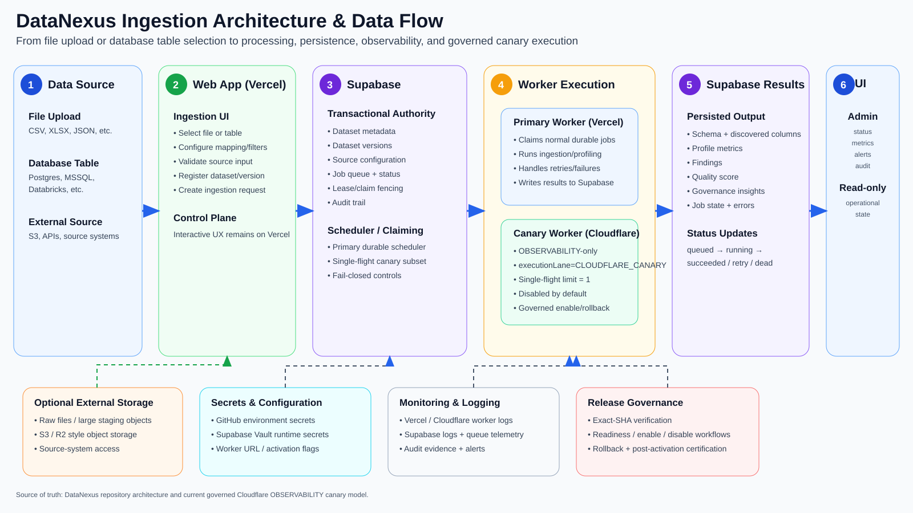

# DataNexus Ingestion Architecture & Data Flow

This document preserves the architecture diagram discussed on 2026-09-22 for the end-to-end flow when a **file** or **database table** is ingested into DataNexus.

## Flow summary

1. **Source**: user uploads a file or selects/configures a database table or external source.
2. **Vercel web app**: validates the request, registers the dataset and dataset version, and creates the ingestion request.
3. **Supabase**: remains the transactional authority for metadata, source configuration, job state, leases, claims, audit, and scheduler state.
4. **Worker execution**:
   - the Vercel worker remains the primary durable execution path;
   - Cloudflare is an optional governed canary lane restricted to tagged **OBSERVABILITY** jobs, single-flight, disabled by default.
5. **Results**: schema discovery, profile metrics, findings, quality scores, governance insights, job status, and errors are persisted to Supabase.
6. **Observability/UI**: DataNexus Admin exposes operational state, metrics, alerts, queue state, and audit evidence without exposing runtime secrets.

## Architecture rules represented

- Supabase remains the scheduler and transactional authority.
- Vercel remains the interactive/control-plane runtime and primary worker.
- Cloudflare is not a second orchestration authority.
- Canary execution is allowlisted to OBSERVABILITY, requires explicit tagging, and is single-flight.
- Secrets stay in GitHub protected environments / Supabase Vault.
- Activation and rollback are exact-SHA governed release operations.
- External object storage is optional and does not replace governance metadata/state in Supabase.
